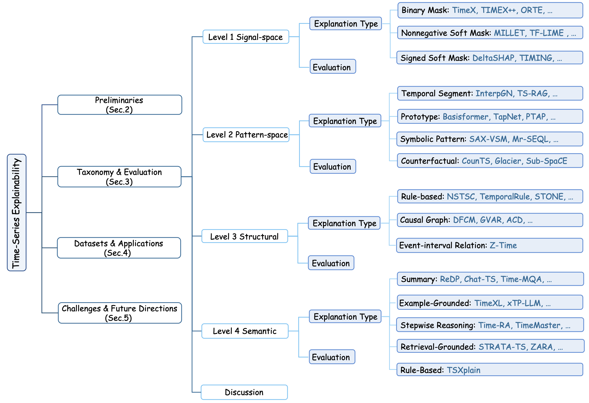
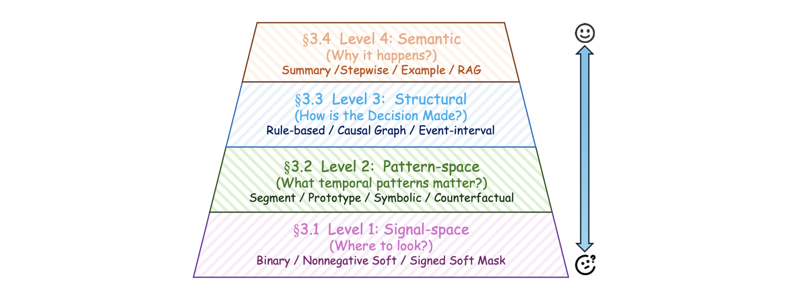

# 🚀 Awesome Time Series Explanation Papers
[](https://github.com/sindresorhus/awesome) [[时序人](https://mp.weixin.qq.com/s/Gi-X2uG5mnYOotUR4Qh2zg)] 

A curated and continuously updated collection of **time series explanation and interpretability** research, covering methods from low-level signal attribution to high-level semantic and LLM-based reasoning.

📌 This repository accompanies our survey paper:  
**[From Signals to Semantics: A Survey on Time Series Explainability through a Human-Cognitive Lens](https://www.techrxiv.org/users/1011574/articles/1371688-from-signals-to-semantics-a-survey-on-time-series-explainability-through-a-human-cognitive-lens)**. We organize time series explanation methods into four cognitive levels: **Signal-space**, **Pattern-space**, **Structural**, **Semantic**.



<!--  -->


### 🔍 What makes this repository useful?
- 📊 **Comprehensive coverage** of time series explainability across tasks such as forecasting, classification, anomaly detection, causality discovery, and open-ended reasoning
- 🧠 **Human-cognitive perspective**, organizing methods by *signal-space, pattern-space, structural,* and *semantic* explanations
- 🤖 **Strong focus on emerging LLM-based semantic explanations**
- 📚 **Curated datasets and benchmarks** for explanation evaluation

### 🧭 How to use this repository?
- If you are new to the field, start with the [Surveys](#surveys) section for a high-level overview.
- If you are interested in **evaluation and benchmarking**, see the [Benchmarks](#benchmarks) and [Evaluations](#evaluations) sections.
- If you work on **LLM-based or semantic explanations**, check the [LLM/VLM/MLLM](#llmvlmmllm) category.
- Papers are also organized chronologically to help track the [evolution of explainability methods](#2025) over time.

This repository is designed to help **researchers and practitioners quickly understand, compare, and navigate** the rapidly growing literature in time series explainability.

We actively maintain this list. If you notice missing or relevant papers, contributions and suggestions are very welcome!

⭐ If you find this project useful, please consider giving it a star to support the work.

## 📖 Citation
If you find this repository useful, please consider citing our survey:

```bibtex
@article{chen2026signals,
  title={From Signals to Semantics: A Survey on Time Series Explainability through a Human-Cognitive Lens},
  author={Chen, Zhuomin and Lucchesi, Gabriel and Dong, Qingkai and Zheng, Xu and Song, Dongjin and Wen, Qingsong and Cheng, Wei and Ni, Jingchao and Luo, Dongsheng},
  journal={Authorea Preprints},
  year={2026},
  publisher={Authorea}
}
```

## 🔖Table of Contents
- [News](#news)
- [Surveys](#surveys)
- [Papers](#papers)
  - [LLM/VLM/MLLM](#llmvlmmllm)
  - [2026](#2026)
  - [2025](#2025)
  - [2024](#2024)
  - [2023](#2023)
  - [2022](#2022)
  - [2021](#2021)
  - [2020](#2020)
  - [2019&before](#2019&before)
- [Benchmarks](#benchmarks)
- [Evaluations](#evaluations)

<!-- 7 Surveys, 2 benchmarks, 3 evaluation, 125 papers -->

## News
- [x] [2026.01.02] We released our [survey](https://www.techrxiv.org/users/1011574/articles/1371688-from-signals-to-semantics-a-survey-on-time-series-explainability-through-a-human-cognitive-lens) and this GitHub repo.

## Surveys

1. [2026] From Signals to Semantics: A Survey on Time Series Explainability through a Human-Cognitive Lens [[link]](https://www.techrxiv.org/users/1011574/articles/1371688-from-signals-to-semantics-a-survey-on-time-series-explainability-through-a-human-cognitive-lens)

2. [2025] A Survey of Explainable Artificial Intelligence (XAI) in Financial Time Series Forecasting [[link]](https://dl.acm.org/doi/pdf/10.1145/3729531)

3. [2023] Interpretation of Time-Series Deep Models: A Survey [[link]](https://arxiv.org/pdf/2305.14582) 

4. [2022] Explainable AI for Time Series Classification: A review, taxonomy and research directions [[link]](https://ieeexplore.ieee.org/stamp/stamp.jsp?tp=&arnumber=9895252)

5. [2022] Post Hoc Explainability for Time Series Classification [[link]](https://ieeexplore.ieee.org/stamp/stamp.jsp?tp=&arnumber=9810094)

6. [2022] Counterfactual explanations and how to find them: literature review and benchmarking [[link]](https://link.springer.com/content/pdf/10.1007/s10618-022-00831-6.pdf)

7. [2021] Explainable Artificial Intelligence (XAI) on Time Series Data: A Survey [[link]](https://arxiv.org/pdf/2104.00950)

## Papers

### LLM/VLM/MLLM

> This category highlights recent efforts that leverage LLMs or multimodal models to provide **semantic, reasoning-based explanations** for time series, representing a shift from attribution-focused XAI to human-centric interpretation.

1. [2026] LLM-Augmented Changepoint Detection: A Framework for Ensemble Detection and Automated Explanation [[link]](https://arxiv.org/pdf/2601.02957)

2. [NIPS 25] Explainable Multi-modal Time Series Prediction with LLM-in-the-Loop [[link]](https://arxiv.org/pdf/2503.01013)

3. [AAAI 25] TimeCAP:  Learning to Contextualize, Augment, and Predict Time Series Events with Large Language Model Agents [[link]](https://arxiv.org/pdf/2502.11418)

4. [2025] Time-MQA: Time Series Multi-Task Question Answering with Context Enhancement [[link]](https://arxiv.org/pdf/2503.01875)

5. [2025] Beyond Naïve Prompting: Strategies for Improved Zero-shot Context-aided Forecasting with LLMs [[link]](https://arxiv.org/pdf/2508.09904v1)

6. [2025] Enhancing LLM Reasoning for Time Series Classification by Tailored Thinking and Fused Decision [[link]](https://arxiv.org/pdf/2506.00807)

7. [NIPS 25] TS-RAG: Retrieval-Augmented Generation based Time Series Foundation Models are Stronger Zero-Shot Forecaster [[link]](https://arxiv.org/pdf/2503.07649)

8. [KDD 25] Large Language Models can Deliver Accurate and Interpretable Time Series Anomaly Detection [[link]](https://arxiv.org/pdf/2405.15370)

9. [2025] Time-RA: Towards Time Series Reasoning for Anomaly with LLM Feedback [[link]](https://arxiv.org/pdf/2507.15066)

10. [2025] GEM: Empowering MLLM for Grounded ECG Understanding with Time Series and Images [[link]](https://arxiv.org/pdf/2503.06073)

11. [2025] Chat-TS: Enhancing Multi-Modal Reasoning Over Time-Series and Natural Language Data [[link]](https://arxiv.org/pdf/2503.10883)

12. [2025] Can Slow-thinking LLMs Reason Over Time? Empirical Studies in Time Series Forecasting [[link]](https://arxiv.org/pdf/2505.24511)

13. [2025] Time Series Forecasting as Reasoning: A Slow-Thinking Approach with Reinforced LLMs [[link]](https://arxiv.org/pdf/2506.10630)

14. [2025] ZARA: Zero-shot Motion Time-Series Analysis via Knowledge and Retrieval Driven LLM Agents [[link]](https://arxiv.org/pdf/2508.04038)

15. [2025] TimeMaster: Training Time-Series Multimodal LLMs to Reason via Reinforcement Learning [[link]](https://arxiv.org/pdf/2506.13705)

16. [ICLR 25] Can LLMs Serve As Time Series Anomaly Detectors? [[link]](https://arxiv.org/pdf/2408.03475)

17. [2025] STRATA-TS: Selective Knowledge Transfer for Urban Time Series Forecasting with Retrieval-Guided Reasoning [[link]](https://arxiv.org/pdf/2508.18635)

18. [ICML 25] FSTLLM: Spatio-Temporal LLM for Few Shot Time Series Forecasting [[link]](https://openreview.net/pdf?id=oyoiHf51es)

19. [2025] AXIS: Explainable Time Series Anomaly Detection with Large Language Models [[link]](https://arxiv.org/pdf/2509.24378) 

30. [2025] Toward Reasoning-Centric Time-Series Analysis [[link]](https://arxiv.org/pdf/2510.13029)

22. [2025] Augur: Modeling Covariate Causal Associations in Time Series via Large Language Models [[link]](https://arxiv.org/pdf/2510.07858)

23. [2024] XForecast: Evaluating Natural Language Explanations for Time Series Forecasting  [[link]](https://arxiv.org/pdf/2410.14180)

24. [2024] Towards explainable traffic flow prediction with large language models [[link]](https://www.sciencedirect.com/science/article/pii/S2772424724000337)

24. [2023] Temporal Data Meets LLM - Explainable Financial Time Series Forecasting [[link]](https://arxiv.org/pdf/2306.11025)

25. [NIPS workshop 23] JoLT: Jointly Learned Representations of Language and Time-Series [[link]](https://openreview.net/pdf?id=UVF1AMBj9u)


### 2026

1. LLM-Augmented Changepoint Detection: A Framework for Ensemble Detection and Automated Explanation [[link]](https://arxiv.org/pdf/2601.02957)

### 2025

1. [ICLR 25]Start Smart: Leveraging Gradients For Enhancing Mask-based XAI Methods [[link]](https://openreview.net/pdf?id=Iht4NNVqk0)

2. [ICLR 25]Shedding Light on Time Series Classification using Interpretability Gated Networks [[link]](https://openreview.net/pdf?id=n34taxF0TC)

3. [AAAI 25]InteDisUX: Intepretation-Guided Discriminative User-Centric Explanation for Time Series [[link]](https://ojs.aaai.org/index.php/AAAI/article/view/35387)

4. [ICML 25]TIMING: Temporality-Aware Integrated Gradients for Time Series Explanation [[link]](https://arxiv.org/pdf/2506.05035)

5. [ICML 25]Optimal Information Retention for Time-Series Explanations [[link]](https://openreview.net/pdf?id=u6k5y3FDW1)

6. [ICML Workshop 25]DeltaSHAP: Explaining Prediction Evolutions in Online Patient Monitoring with Shapley Values [[link]](https://arxiv.org/pdf/2507.02342)

7. TF-LIME: Interpretation Method for Time-Series Models Based on Time–Frequency Features [[link]](https://www.mdpi.com/1424-8220/25/9/2845)

8. Implet: A Post-hoc Subsequence Explainer for Time Series Models [[link]](https://arxiv.org/pdf/2505.08748)

9. [NIPS 25] Explainable Multi-modal Time Series Prediction with LLM-in-the-Loop [[link]](https://arxiv.org/pdf/2503.01013)

10. [AAAI 25]TimeCAP: Learning to Contextualize, Augment, and Predict Time Series Events with Large Language Model Agents [[link]](https://arxiv.org/pdf/2502.11418)

11. Time-MQA: Time Series Multi-Task Question Answering with Context Enhancement [[link]](https://arxiv.org/pdf/2503.01875)

12. Beyond Naïve Prompting: Strategies for Improved Zero-shot Context-aided Forecasting with LLMs [[link]](https://arxiv.org/pdf/2508.09904v1) 

13. Enhancing LLM Reasoning for Time Series Classification by Tailored Thinking and Fused Decision [[link]](https://arxiv.org/pdf/2506.00807)

14. Unifying Prediction and Explanation in Time-Series Transformers via Shapley-based Pretraining [[link]](https://ieeexplore.ieee.org/stamp/stamp.jsp?tp=&arnumber=10933141)

15. Counterfactual Explanation for Auto-Encoder Based Time-Series Anomaly Detection [[link]](https://arxiv.org/pdf/2501.02069)

16. Learning Reliable and Intuitive Temporal Logic Rules for Interpretable Time Series Classification [[link]](https://dl.acm.org/doi/pdf/10.1145/3711896.3737022)

17. Explaining Time Series Classifiers with PHAR: Rule Extraction and Fusion from Post-hoc Attributions [[link]](https://arxiv.org/pdf/2508.01687)

18. [NIPS 25] ShapeX: Shapelet-Driven Post Hoc Explanations for Time Series Classification Models [[link]](https://neurips.cc/virtual/2025/poster/119156)

19. [NIPS 25] Contimask: Explaining Irregular Time Series via Perturbations in Continuous Time [[link]](https://neurips.cc/virtual/2025/poster/118675)

20. [NIPS 25] Structured Temporal Causality for Interpretable Multivariate Time Series Anomaly Detection [[link]](https://neurips.cc/virtual/2025/poster/117720)

21. ProtoTS: Learning Hierarchical Prototypes for Explainable Time Series Forecasting [[link]](https://arxiv.org/pdf/2509.23159)

22. When, How Long and How Much? Interpretable Neural Networks for Time Series Regression by Learning to Mask and Aggregate [[link]](https://arxiv.org/pdf/2512.03578)

23. A Self-explainable Model of Long Time Series by Extracting Informative Structured Causal Patterns [[link]](https://arxiv.org/pdf/2512.01412)

24. Delta-XAI: A Unified Framework for Explaining Prediction Changes in Online Time Series Monitoring [[link]](https://arxiv.org/pdf/2511.23036)

25. Toward Reasoning-Centric Time-Series Analysis [[link]](https://arxiv.org/pdf/2510.13029)

26. Augur: Modeling Covariate Causal Associations in Time Series via Large Language Models [[link]](https://arxiv.org/pdf/2510.07858)

27. [AAAI 25] Temporal Concept Tracing: Making Deep Learning Predictions Interpretable and Actionable for ICU Acute Kidney Injury Prevention [[link]](https://ojs.aaai.org/index.php/AAAI-SS/article/view/36917)

### 2024

1. [ICLR 24]Explaining Time Series via Contrastive and Locally Sparse Perturbations [[link]](https://openreview.net/pdf?id=qDdSRaOiyb)

2. [ICLR 24]Inherently Interpretable Time Series Classification via Multiple Instance Learning [[link]](https://arxiv.org/pdf/2311.10049)

3. [ICML 24]TIMEX++: Learning Time-Series Explanations with Information Bottleneck [[link]](https://arxiv.org/abs/2405.09308)

4. [CIKM 24]Time is Not Enough: Time-Frequency based Explanation for Time-Series Black-Box Models  [[link]](https://arxiv.org/pdf/2408.03636)

5. Glacier: guided locally constrained counterfactual explanations for time series classification [[link]](https://link.springer.com/content/pdf/10.1007/s10994-023-06502-x.pdf)

6. Sub-SpaCE: Subsequence-Based Sparse Counterfactual Explanations for Time Series Classification Problems [[link]](https://link.springer.com/chapter/10.1007/978-3-031-63800-8_1)

7. IndMask: Inductive Explanation for Multivariate Time Series Black-Box Models [[link]](https://pdfs.semanticscholar.org/72f6/873b03f8ec549011dfca3dc4ae7a7adc7451.pdf)

8. FLEXtime: Filterbank learning to explain time series [[link]](https://arxiv.org/pdf/2411.05841)

9. Z‑Time: efficient and effective interpretable multivariate time series classification [[link]](https://link.springer.com/article/10.1007/s10618-023-00969-x)

10. Explainable AI for Time Series via Virtual Inspection Layers [[link]](https://arxiv.org/pdf/2303.06365)

11. Neural-Symbolic Temporal Decision Trees for Multivariate Time Series Classification [[link]](https://drops.dagstuhl.de/storage/00lipics/lipics-vol247-time2022/LIPIcs.TIME.2022.13/LIPIcs.TIME.2022.13.pdf)

12. A global model-agnostic rule-based XAI method based on Parameterized Event Primitives for time series classifiers [[link]](https://www.frontiersin.org/journals/artificial-intelligence/articles/10.3389/frai.2024.1381921/full)

13. [TKDE 24] CausalFormer: An Interpretable Transformer for Temporal Causal Discovery [[link]](https://arxiv.org/pdf/2406.16708)

### 2023

1. [ICLR 23]Temporal Dependencies in Feature Importance for Time Series Prediction [[link]](https://arxiv.org/pdf/2107.14317)

2. [ICML 23]Learning Perturbations to Explain Time Series Predictions [[link]](https://arxiv.org/pdf/2305.18840)

3. [ICML 23]Self-Interpretable Time Series Prediction with Counterfactual Explanations [[link]](https://openreview.net/pdf?id=JPMT9kjeJi)

4. [NIPS 23]Encoding Time-Series Explanations through Self-Supervised Model Behavior Consistency [[link]](https://openreview.net/pdf?id=yEfmhgwslQ)

5. Explaining time series classifiers through meaningful perturbation and optimization [[link]](https://www.sciencedirect.com/science/article/pii/S0020025523009192?via%3Dihub)

6. CELS: Counterfactual Explanations for Time Series Data via Learned Saliency Maps [[link]](https://ieeexplore.ieee.org/abstract/document/10386229)

7. ShapTime: A General XAI Approach for Explainable Time Series Forecasting [[link]](https://link.springer.com/chapter/10.1007/978-3-031-47721-8_45)

8. Temporal Data Meets LLM-Explainable Financial Time Series Forecasting [[link]](https://arxiv.org/pdf/2306.11025)

9. [NIPS 23]Basisformer: Attention-based time series forecasting with learnable and interpretable basis [[link]](https://arxiv.org/pdf/2310.20496)

10. [IJCAI 23] DeLELSTM: Decomposition-based Linear Explainable LSTM to Capture Instantaneous and Long-term Effects in Time Series [[link]](https://www.ijcai.org/proceedings/2023/0478.pdf)

11. Time-Incremental Learning of Temporal Logic Classifiers Using Decision Trees [[link]](https://proceedings.mlr.press/v211/aasi23a/aasi23a.pdf)

12. Learning Signal Temporal Logic through Neural Network for Interpretable Classification [[link]](https://arxiv.org/pdf/2210.01910)

13. [ICLR 23] CUTS: Neural causal discovery from irregular time-series data [[link]](https://arxiv.org/pdf/2302.07458)


### 2022

1. [ICDM 22]Class-Specific Explainability for Deep Time Series Classifiers [[link]](https://arxiv.org/pdf/2210.05411)

2. [ICDM 22]Neuro-symbolic models for interpretable time series classification using temporal logic description [[link]](https://arxiv.org/pdf/2209.09114)

3. [AISTATS 22]LIMESegment: Meaningful, Realistic Time Series Explanation [[link]](https://proceedings.mlr.press/v151/sivill22a/sivill22a.pdf)

4. Shapelet-Based Counterfactual Explanations for Multivariate Time Series [[link]](https://arxiv.org/pdf/2208.10462)

5. XEM: An Explainable-by-Design Ensemble Method for Multivariate Time Series Classification [[link]](https://arxiv.org/pdf/2005.03645)

<!-- 7. [ICMLA 22]Temporal rule-based counterfactual explanations for multivariate time series [[link]](https://ieeexplore.ieee.org/stamp/stamp.jsp?tp=&arnumber=10069254) same with 4 --> 

6. [ICMLA 22]TSEvo: Evolutionary Counterfactual Explanations for Time Series Classification [[link]](https://ieeexplore.ieee.org/stamp/stamp.jsp?tp=&arnumber=10069160)

7. Motif-guided time series counterfactual explanations [[link]](https://arxiv.org/pdf/2211.04411)

8. [TKDE]Explainable tensorized neural ordinary differential equations for arbitrary-step time series prediction [[link]](https://ieeexplore.ieee.org/stamp/stamp.jsp?tp=&arnumber=97578120)

9. Diverse counterfactual explanations for anomaly detection in time series [[link]](https://arxiv.org/pdf/2203.11103)

10. [AAAI 22]LIMREF: Local Interpretable Model Agnostic Rule-based Explanations for Forecasting, with an Application to Electricity Smart Meter Data [[link]](https://arxiv.org/pdf/2202.07766)

11. Amortized Causal Discovery: Learning to Infer Causal Graphs from Time-Series Data [[link]](https://arxiv.org/pdf/2006.10833)

### 2021

1. [ICML 21]Explaining time series predictions with dynamic masks [[link]](https://arxiv.org/pdf/2106.05303)

2. [KDD 21]TimeSHAP: Explaining Recurrent Models through Sequence Perturbations [[link]](https://arxiv.org/pdf/2012.00073)

3. [CIKM 21] Learning saliency maps to explain deep time series classifier [[link]](https://dl.acm.org/doi/pdf/10.1145/3459637.3482446)

4. Temporal Fusion Transformers for interpretable multi-horizon time series forecasting [[link]](https://www.sciencedirect.com/science/article/pii/S0169207021000637)

5. Counterfactual Explanations for Multivariate Time Series [[link]](https://ieeexplore.ieee.org/document/9462056)

6. XCM: An Explainable Convolutional Neural Network for Multivariate Time Series Classification [[link]](https://arxiv.org/pdf/2009.04796)

7. Instance-based Counterfactual Explanations for Time Series Classification [[link]](https://arxiv.org/pdf/2009.13211)

8. Multi-modal prototype learning for interpretable multivariable time series classification [[link]](https://arxiv.org/pdf/2106.09636)

9. Tsinsight: A local-global attribution framework for interpretability in time series data [[link]](https://www.mdpi.com/1424-8220/21/21/7373)

10. Deep fuzzy cognitive maps for interpretable multivariate time series prediction [[link]](https://ieeexplore.ieee.org/stamp/stamp.jsp?tp=&arnumber=9132654)

11. Explainable multivariate time series classification: a deep neural network which learns to attend to important variables as well as time intervals [[link]](https://dl.acm.org/doi/pdf/10.1145/3437963.3441815)

12. Interpreting internal activation patterns in deep temporal neural networks by finding prototypes [[link]](https://dl.acm.org/doi/pdf/10.1145/3447548.3467346)

13. Learning Time Series Counterfactuals via Latent Space Representations [[link]](https://link.springer.com/chapter/10.1007/978-3-030-88942-5_29)

14. STONE: Signal Temporal Logic Neural Network for Time Series Classification [[link]](https://par.nsf.gov/servlets/purl/10426016)

15. [ICLR 21]Interpretable Models for Granger Causality Using Self-explaining Neural Networks [[link]](https://arxiv.org/pdf/2101.07600)

16. Causal and Interpretable Rules for Time Series Analysis [[link]](https://lepennec.perso.math.cnrs.fr/Reprint/Causality/2021-KDD-DBGGLP.pdf)


### 2020

1. [ICLR 20]N-BEATS: Neural basis expansion analysis for interpretable time series forecasting [[link]](https://arxiv.org/pdf/1905.10437)

2. [NIPS 20] What went wrong and when? Instance-wise feature importance for time-series black-box models [[link]](https://arxiv.org/pdf/2003.02821)

3. [KDD 20] Preserving Dynamic Attention for Long-Term Spatial-Temporal Prediction [[link]](https://arxiv.org/pdf/2006.08849)

4. Explaining Any Time Series Classifier [[link]](https://ieeexplore.ieee.org/document/9319285)

5. Interpretable Multivariate Time Series Forecasting with Temporal Attention Convolutional Neural Networks [[link]](https://ieeexplore.ieee.org/document/9308570)

6. Series Saliency: Temporal Interpretation for Multivariate Time Series Forecasting [[link]](https://arxiv.org/abs/2012.09324)

7. Tapnet: Multivariate time series classification with attentional prototypical network [[link]](https://ojs.aaai.org/index.php/AAAI/article/view/6165)

8. Interpretable time-series classification on few-shot samples [[link]](https://ieeexplore.ieee.org/stamp/stamp.jsp?tp=&arnumber=9206860)

9. Adversarial dynamic shapelet networks [[link]](https://ojs.aaai.org/index.php/AAAI/article/view/5948)

10. Locally and globally explainable time series tweaking [[link]](https://link.springer.com/article/10.1007/s10115-019-01389-4)

11. [CIKM 20] Imbalanced time series classification for flight data analyzing with nonlinear Granger causality learning [[link]](https://dl.acm.org/doi/abs/10.1145/3340531.3412710?casa_token=i-7JCEgHb9AAAAAA:AQHhTfVe9i9sW4m_ig0JNKDdyuHSztapr0ruGNZmketIxzbtkyCocDGo9RUafl_5HwraCB-TtC2r)

12. Interpretable classification of time-series data using efficient enumerative techniques [[link]](https://arxiv.org/pdf/1907.10265)

### 2019&before

1. [ICML 19]Exploring Interpretable LSTM Neural Networks over Multi-Variable Data [[link]](https://arxiv.org/pdf/1905.12034)

2. [ICDM 19]MTEX-CNN: Multivariate Time Series EXplanations for Predictions with Convolutional Neural Networks [[link]](https://ieeexplore.ieee.org/document/8970899)

3. [ICTAI 19]Agnostic local explanation for time series classification [[link]](https://ieeexplore.ieee.org/stamp/stamp.jsp?tp=&arnumber=8995349)

4. TSXplain: Demystification of DNN Decisions for Time-Series using Natural Language and Statistical Features [[link]](https://arxiv.org/pdf/1905.06175)

5. Explaining Deep Classification of Time-Series Data with Learned Prototypes [[link]](https://arxiv.org/pdf/1904.08935)

6. Interpretable time series classification using linear models and multi-resolution multi-domain symbolic representations [[link]](https://link.springer.com/article/10.1007/s10618-019-00633-3)

7. Causal Discovery with Attention-Based Convolutional Neural Networks [[link]](https://www.mdpi.com/2504-4990/1/1/19)

8. [AAAI 19]Deep neural networks constrained by decision rules [[link]](https://ojs.aaai.org/index.php/AAAI/article/view/4095)

9. [KDD 18]Multilevel wavelet decomposition network for interpretable time series analysis [[link]](https://dl.acm.org/doi/pdf/10.1145/3219819.3220060)

10. [ICDE 18]Efficient learning interpretable shapelets for accurate time series classification [[link]](https://ieeexplore.ieee.org/stamp/stamp.jsp?tp=&arnumber=8509273)

11. [NIPS 16]Retain: An interpretable predictive model for healthcare using reverse time attention mechanism [[link]](https://arxiv.org/abs/1608.05745)

12. [KDD 14]Learning time-series shapelets [[link]](https://dl.acm.org/doi/pdf/10.1145/2623330.2623613)

13. [ICDM 13]Sax-vsm: Interpretable time series classification using sax and vector space model [[link]](https://ieeexplore.ieee.org/stamp/stamp.jsp?tp=&arnumber=6729617)

14. [KDD 12]A shapelet transform for time series classification [[link]](https://dl.acm.org/doi/pdf/10.1145/2339530.2339579)

15. [KDD 11]Logical-shapelets: an expressive primitive for time series classification [[link]](https://dl.acm.org/doi/pdf/10.1145/2020408.2020587)

16. Time series shapelets: a novel technique that allows accurate, interpretable and fast classification [[link]](https://link.springer.com/content/pdf/10.1007/s10618-010-0179-5.pdf)

## Benchmarks

1. [2024] Benchmarking Counterfactual Interpretability in Deep Learning Models for Time Series Classification [[link]](https://arxiv.org/pdf/2408.12666)

2. [2020] Benchmarking Deep Learning Interpretability in Time Series Predictions [[link]](https://arxiv.org/pdf/2010.13924)

<p align="center"><strong>Table 1. Summary of synthetic datasets</strong></p>

| Data                  | Type                     | Task              | Explanation Level | Source                                                                                                                   |
| --------------------- | ------------------------ | ----------------- | ----------------- | ------------------------------------------------------------------------------------------------------------------------ |
| WebTraffic            | Univariate Time Series   | Classification    | Signal-space      | [Link](https://github.com/JAEarly/MILTimeSeriesClassification)                                                           |
| FreqShapes            | Univariate Time Series   | Classification    | Signal-space      | [Link](https://github.com/zichuan-liu/TimeXplusplus)                                                                     |
| SeqComb-UV            | Univariate Time Series   | Classification    | Signal-space      | [Link](https://proceedings.neurips.cc/paper_files/paper/2023/file/65ea878cb90b440e8b4cd34fe0959914-Paper-Conference.pdf) |
| Synthetic Traces      | Univariate Time Series   | Classification    | Structural        | [Link](https://dl.acm.org/doi/pdf/10.1145/3365365.3382218)                                                               |
| Switch-Feature        | Multivariate Time Series | Classification    | Signal-space      | [Link](https://github.com/zichuan-liu/ContraLSP)                                                                         |
| State                 | Multivariate Time Series | Classification    | Signal-space      | [Link](https://github.com/zichuan-liu/ContraLSP)                                                                         |
| Spike                 | Multivariate Time Series | Classification    | Signal-space      | [Link](https://proceedings.neurips.cc/paper/2020/file/08fa43588c2571ade19bc0fa5936e028-Paper.pdf)                        |
| Toy                   | Multivariate Time Series | Classification    | Pattern-space     | [Link](https://proceedings.mlr.press/v202/yan23d/yan23d.pdf)                                                             |
| SeqComb-MV            | Multivariate Time Series | Classification    | Signal-space      | [Link](https://proceedings.neurips.cc/paper_files/paper/2023/file/65ea878cb90b440e8b4cd34fe0959914-Paper-Conference.pdf) |
| LowVar                | Multivariate Time Series | Classification    | Signal-space      | [Link](https://proceedings.neurips.cc/paper_files/paper/2023/file/65ea878cb90b440e8b4cd34fe0959914-Paper-Conference.pdf) |
| Naval Surveillance    | Multivariate Time Series | Classification    | Structural        | [Link](https://proceedings.mlr.press/v211/aasi23a/aasi23a.pdf)                                                           |
| Urban Driving         | Multivariate Time Series | Classification    | Structural        | [Link](https://proceedings.mlr.press/v211/aasi23a/aasi23a.pdf)                                                           |
| Simulated Full Flight | Multivariate Time Series | Classification    | Structural        | [Link](https://dl.acm.org/doi/pdf/10.1145/3340531.3412710)                                                               |
| Rare-Time             | Multivariate Time Series | Regression        | Signal-space      | [Link](https://github.com/JonathanCrabbe/Dynamask)                                                                       |
| Rare-feature          | Multivariate Time Series | Regression        | Signal-space      | [Link](https://github.com/sanatonek/time_series_explainability)                                                          |
| Rare-Observation      | Multivariate Time Series | Regression        | Signal-space      | [Link](https://github.com/zichuan-liu/ContraLSP)                                                                         |
| Semantic Benchmark    | Univariate Time Series   | Anomaly Detection | Semantic          | [Link](https://arxiv.org/pdf/2509.24378)                                                                                 |
| Machine Benchmark     | Univariate Time Series   | Anomaly Detection | Semantic          | [Link](https://arxiv.org/pdf/1905.06175)                                                                                 |
| SKAB                  | Multivariate Time Series | Anomaly Detection | Pattern-space     | [Link](https://arxiv.org/pdf/2203.11103)                                                                                 |
| Lorenz 96             | Multivariate Time Series | Causal Discovery  | Structural        | [Link](https://github.com/lingbai-kong/CausalFormer)                                                                     |
| fMRI                  | Multivariate Time Series | Causal Discovery  | Structural        | [Link](https://github.com/lingbai-kong/CausalFormer)                                                                     |
| Netsim                | Multivariate Time Series | Causal Discovery  | Structural        | [Link](https://github.com/sakhanna/SRU_for_GCI/tree/master/data/netsim)                                                  |


## Evaluations

1. [2025] On the Necessity of Multi-Domain Explanation: An Uncertainty Principle Approach for Deep Time Series Models [[link]](https://arxiv.org/pdf/2506.03267) 

2. [2024] Explanation Space: A New Perspective into Time Series Interpretability [[link]](https://arxiv.org/pdf/2409.01354)

3. [2024] XForecast: Evaluating Natural Language Explanations for Time Series Forecasting [[link]](https://arxiv.org/pdf/2410.14180)
